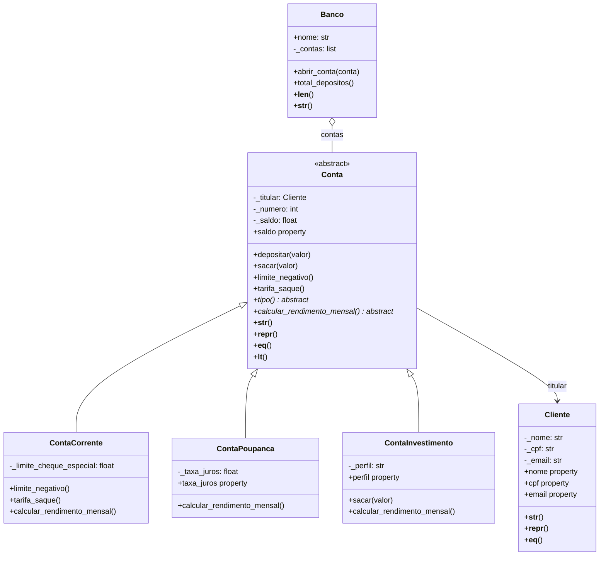

# Semana 06 – Sistema Bancário Orientado a Objetos (Desafio Sprint 6)

Sistema bancário com classes, encapsulamento, herança, polimorfismo e classe abstrata.

## Como executar

```bash
python3 main.py
```

## Estrutura

| Arquivo | Conteúdo |
|---|---|
| `modelos.py` | Classes `Cliente`, `Conta` (abstrata), `ContaCorrente`, `ContaPoupanca`, `ContaInvestimento` e `Banco` |
| `main.py` | Demonstração: 11+ instâncias, polimorfismo, métodos especiais e tratamento de exceções |

## Diagrama de classes



## Decisões de modelagem

- **Herança** (relação "é um"): `ContaCorrente`, `ContaPoupanca` e `ContaInvestimento` **são** contas. Elas reaproveitam `depositar`, `sacar`, o controle de saldo e o número sequencial da classe mãe, e chamam `super().__init__(...)` no construtor.
- **Classe abstrata**: `Conta` herda de `ABC` e declara `tipo()` e `calcular_rendimento_mensal()` com `@abstractmethod`. Não é possível instanciar uma "conta genérica"; toda conta concreta é obrigada a cumprir esse contrato.
- **Composição** (relação "tem um"): uma `Conta` **tem** um `Cliente` como titular, e um `Banco` **tem** uma lista de contas. Um cliente não "é" uma conta, então herança não faria sentido.
- **Polimorfismo**: `calcular_rendimento_mensal()` é sobrescrito em cada filha (corrente cobra manutenção, poupança rende juros, investimento rende conforme o perfil). `limite_negativo()`, `tarifa_saque()` e `sacar()` também são sobrescritos para mudar as regras de saque sem duplicar código.
- **Sem mutáveis como padrão**: `Banco(nome, contas=None)` cria a lista dentro do construtor, e a property `contas` devolve uma cópia defensiva.

## Validações com `@property`

| Classe | Atributo | Regra |
|---|---|---|
| `Cliente` | `nome` | não pode ser vazio |
| `Cliente` | `cpf` | formato `000.000.000-00`; somente leitura após a criação |
| `Cliente` | `email` | formato `usuario@dominio.ext` (regex) |
| `Conta` | `saldo` | nunca abaixo de `limite_negativo()` (0 na poupança/investimento, `-cheque especial` na corrente) |
| `ContaPoupanca` | `taxa_juros` | entre 0% e 5% ao mês |
| `ContaInvestimento` | `perfil` | `conservador`, `moderado` ou `arrojado` |

Como as validações estão nos setters e o `__init__` usa esses setters, nenhum objeto inválido chega a existir.

## Exemplo de uso

```python
from modelos import Cliente, ContaCorrente, ContaPoupanca

ana = Cliente("Ana Souza", "123.456.789-00", "ana@email.com")
corrente = ContaCorrente(ana, 1500, limite_cheque_especial=1000)
poupanca = ContaPoupanca(ana, 8000)

corrente.sacar(2000)              # usa o cheque especial (+ tarifa de R$ 1,50)
print(corrente)                   # Conta Corrente nº 001 | Ana Souza | Saldo: R$ -501.50 | ...

for conta in (corrente, poupanca):
    print(conta.calcular_rendimento_mensal())   # -15.0 e 40.0 (polimorfismo)

try:
    poupanca.sacar(100000)
except ValueError as erro:
    print(erro)                   # Saldo não pode ficar abaixo de R$ 0.00.
```
